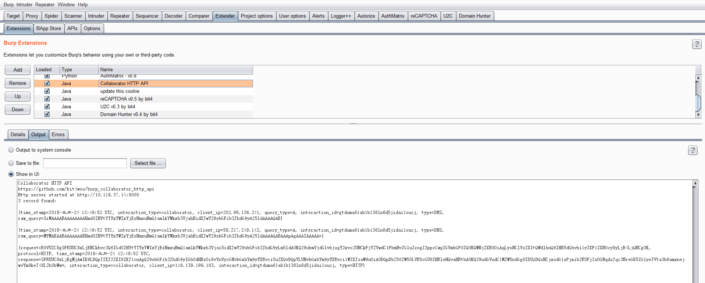
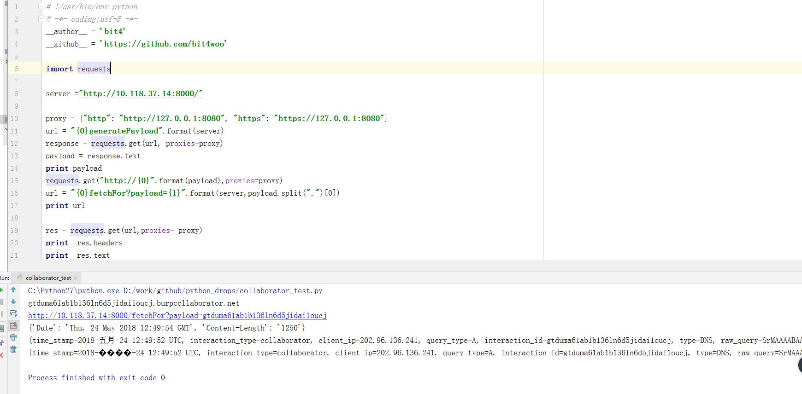

# burp_collaborator_http_api

A burp extender that let you use burp collaborator server within http api

一个让你可以通过HTTP API调用burp的collaborator服务器的插件


- 听说你想用cloudeye,而又没有注册码？
- 听说你想用dnslog，而又嫌太麻烦？
- 听说你想用ceye，而又怕认证？

这个插件让你分分钟用上burp版本的dnslog.


##部署说明：

*最简单的方式一：运行burp pro并安装[这个插件](https://github.com/bit4woo/burp_collaborator_http_api/releases/latest)即可。*

这个方式使用的是burp官方的服务器




方式二：自建burp collaborator服务器，这样就能做到完全独立自主了。

这个参考官方文档：https://portswigger.net/burp/help/collaborator_deploying
github上也有docker版的部署方法：https://github.com/integrity-sa/burpcollaborator-docker


##接口说明：

生成payload：
http://127.0.0.1:8000/generatePayload

获取payload的记录：
http://127.0.0.1:8000/fetchFor?payload=e0f34wndn15gs5xyisqzw8nwyn4ds2
目前这个接口是一股脑的原样返回，数据没有做处理，但足以判断命令是否执行成功。后续会优化


它可以接受的请求类型包括: http\https\DNS\SMTP\SMTPS\FTP；demo版本暂不区分，后续有空会继续优化，提供特定类型的查询和数据提取。


##接口调用举例
简单的python调用举例：
```
# !/usr/bin/env python
# -*- coding:utf-8 -*-
__author__ = 'bit4'
__github__ = 'https://github.com/bit4woo'

import requests

proxy = {"http": "http://127.0.0.1:8888", "https": "https://127.0.0.1:8888"}
url = "http://127.0.0.1:8000/generatePayload"
response = requests.get(url)
payload = response.text
print payload
requests.get("http://{0}".format(payload))
url = "http://127.0.0.1:8000/fetchFor?payload={0}".format(payload.split(".")[0])
res = requests.get(url)
print  res.content

```



##尝试在无图形界面的linux上运行：

这部分还在研究中，如果你有好的方法，欢迎提交给我，谢谢！

```
sudo java -jar burp.jar --collaborator-server #最简单的部署一个collaborator服务器的方式

java -jar burpsuite_pro_1.7.33.jar --user-config-file=collaborator_http_api.json #启动burp并加装指定插件，需要先在json中配置

java -Djava.awt.headless=true -jar burpsuite_pro_1.7.33.jar --user-config-file=collaborator_http_api.json #不启动图形界面


```
